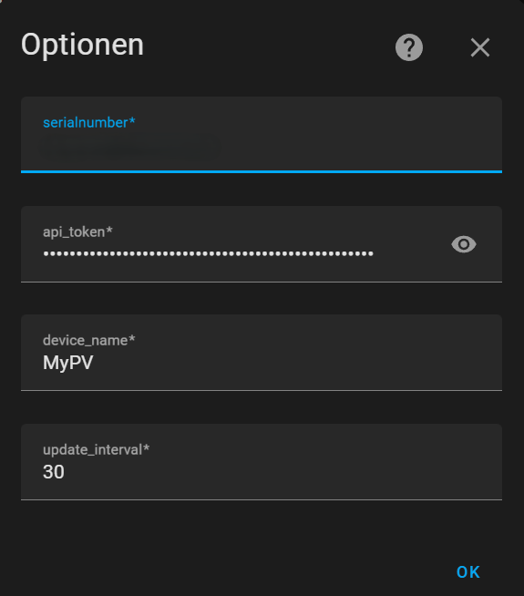
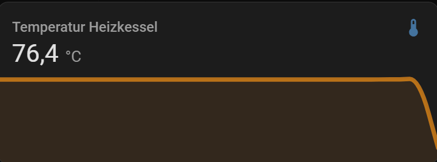

# ⚠️ **BETA VERSION**

## MyPv-HomeAssistant-Integration

## Description

The MyPv Home Assistant integration enables you to seamlessly connect your MyPv device to Home Assistant using the official MyPv API. It retrieves sensor data from your MyPv device, such as temperature, power, voltage, and WiFi signal strength, and displays it in Home Assistant. This integration allows you to set the sampling rate yourself, with a minimum interval of 10 seconds. Sensors that do not provide data are automatically deactivated within the integration but are reactivated once they start providing data again. Configuration is simple, requiring only the serial number and API token from your MyPv account.

**Note**: The MyPv API provided by the manufacturer is also in a BETA stage.

## Installation Guide

Follow the steps below to install the MyPv-HomeAssistant integration.

### HACS Installation

1. Ensure you have [HACS](https://hacs.xyz/) installed in your Home Assistant.
2. Go to HACS.
3. Click on the three dots in the top right corner and select `Custom Repositories`.
4. Add the URL of this repository (`https://github.com/Loppel-Hub/022025`) and select `Integration` as the category.
5. Click `Add`.
6. Restart Home Assistant.
7. Go back to the HACS dashboard, click on `Integrations`, and search for `MyPv-HomeAssistant-Integration`.
8. Click `Install`.

### Manual Installation

1. Download the `MyPv-HomeAssistant` directory from GitHub.
2. Navigate to the `custom_components` directory of Home Assistant and copy the `MyPv-HomeAssistant` directory into it.
3. Restart Home Assistant.

## Configuration

1. Go to the Home Assistant user interface.
2. Navigate to `Settings` > `Integrations`.
3. Click on `Add Integration` and search for `MyPV_Integration`.
4. Enter the required configuration data:
    - **serialnumber**: The serial number of your MyPv device.
    - **api_token**: Your API token obtained from the MyPv API.

**Note**: It may take a few minutes for all entities to be displayed and available.

## Manual Update

To manually update the MyPv-HomeAssistant integration, follow these steps:

1. Download the latest version of the `MyPv-HomeAssistant-Integration` directory from GitHub.
2. Navigate to the `custom_components` directory of Home Assistant.
3. Delete the existing `MyPv-HomeAssistant` directory.
4. Copy the newly downloaded `MyPv-HomeAssistant` directory into the `custom_components` directory.
5. Restart Home Assistant.

## API Configuration Data

To obtain the configuration data (serial number and API token), follow these steps:

1. Register on the [MyPv Cloud](https://live.my-pv.com/) and log in. This is where you can see your MyPv device in the cloud and create an account.
2. Navigate to your profile and go to the API settings.
3. Note down the serial number of your device and generate an API token.
4. Wait for 10 minutes after generating the token for it to become active.

**Important**: Keep your API token secure and do not share it publicly.

**Note**: To enable the use of the API, you must activate the cloud mode on the device beforehand. This can only be done locally on the device via the display or local web interface.

For more information about the manufacturer, visit the [MyPv website](https://www.my-pv.com).

## Additional Information

- **API Documentation**: [my-PV API](https://api.my-pv.com/api-docs/#/)
- **Documentation**: [GitHub Repository](https://github.com/Loppel-Hub/022025/blob/main/INFO.md)
- **Codeowners**: [@Loppel-Hub](https://github.com/Loppel-Hub)
- **License**: This project is licensed under the MIT. See the [LICENSE](LICENSE) file for more details.

## Images

## Future Plans

- [ ] Add Logo to the integration
- [ ] Integrate in HACS

## Completed Plans

- [✓] In the configuration: a custom setting for the sampling rate of sensor values.
- [✓] Dynamically remove sensors with the value "null" and re-add them if they report an accepted value.
- [✓] Change the valid configuration control to the name of the device.

## Acknowledgements

This project was inspired by the [homeassistant-mvpv](https://github.com/zaubererty/homeassistant-mvpv) integration by [zaubererty](https://github.com/zaubererty).

## A Small Note

This project was primarily created because I wanted to have it in my Home Assistant via HACS. This is my very first integration for Home Assistant. I am not a professional programmer but rather a beginner. Therefore, please be patient if there are any issues. Also, my time is often very limited, so changes or further developments may take a bit longer. Additionally, I have only tested this integration with an AC ELWA 2 device.
